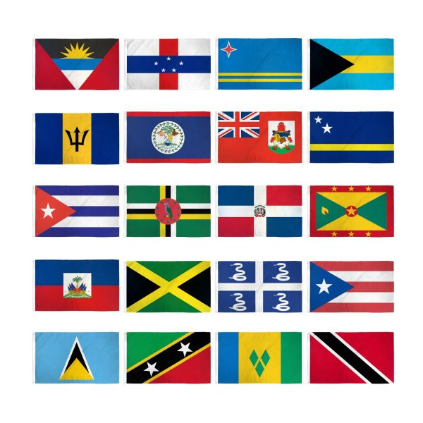

# Awesome-Caribbean-IT-Professionals
A curated list of amazing software developer/engineers/IT Professionals from the islands or with Caribbean heritage.

The Caribbean islands is home to and have produced a lot of talent in software, web, cloud development and tech overall.

The list is divided into categories and more can be added.
Contributors are guided to add an individual's name and a link to their github page or personal site.

# Software Engineers

* Joel Dean https://github.com/jd-alexander
* Cecil Phillip https://cecilphillip.com/
* Khary Sharpe https://github.com/kharysharpe

# Web Developers

# Devops Engineers

* Dale Kurt Murray https://github.com/dalekurt

# Cyber Security Professionals

* Gavin Dennis https://gavindennis.com/
